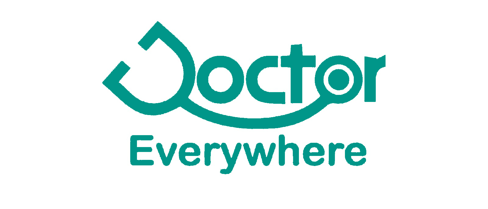

# Checkout Project -->  https://doctor-every-where.vercel.app/

# 🏥 DoctorEveryWhere - Complete Healthcare Platform

<div align="center">
  
  
  **A modern, responsive healthcare platform connecting patients with medical professionals**
  
  [🚀 Live Demo](https://doctor-every-where.vercel.app/) 
</div>

---

## ✨ Features

### 🩺 **Core Services**
- **Doctor Consultations** - Online consultations with qualified medical professionals
- **Blood Test Booking** - Comprehensive blood testing packages with fast results
- **X-Ray Services** - Advanced imaging with state-of-the-art equipment

### 🌟 **Platform Highlights**
- 📱 **Responsive Design** - Seamless experience across all devices
- 🎨 **Modern UI/UX** - Clean, intuitive interface with smooth animations
- ⚡ **Fast Performance** - Optimized with Next.js and Turbopack
- 🔒 **Secure Booking** - Protected patient data with email notifications
- 🎯 **Smart Components** - Reusable, modular architecture
- 🌙 **Hero Slider** - Dynamic image carousel with auto-advance
- 📧 **Email Integration** - Nodemailer-powered booking confirmations

---

## 🛠️ Tech Stack

| Category | Technologies |
|----------|-------------|
| **Frontend** | Next.js 15.3.5, React 19, TailwindCSS 4.1.11 |
| **UI/UX** | Framer Motion, Lucide React Icons, Material-UI |
| **Backend** | Next.js API Routes, Nodemailer |
| **Styling** | TailwindCSS, PostCSS, Autoprefixer |
| **Development** | ESLint, Turbopack, Hot Reload |

---

## 🚀 Quick Start

### Prerequisites
- Node.js 18+ 
- npm/yarn/pnpm
- Gmail account (for email functionality)

### Installation

```bash
# Clone the repository
git clone https://github.com/yourusername/doctor-everywhere.git

# Navigate to project directory
cd doctor-everywhere

# Install dependencies
npm install
# or
yarn install

# Set up environment variables
cp .env.example .env.local
```

### Environment Variables

Create a `.env.local` file in the root directory:

```env
EMAIL_USER=your-gmail@gmail.com
EMAIL_PASS=your-app-password
```

### Development

```bash
# Start development server with Turbopack
npm run dev

# Build for production
npm run build

# Start production server
npm start

# Run linting
npm run lint
```

Open [http://localhost:3000](http://localhost:3000) to view the application.

---

## 📁 Project Structure

```
doctor-everywhere/
├── 📁 public/                 # Static assets
│   ├── 🖼️ images/            # Medical service images
│   └── 🎨 logo files         # Brand assets
├── 📁 src/
│   ├── 📁 app/               # Next.js App Router
│   │   ├── 📄 page.js        # Homepage
│   │   ├── 🩺 doctor-consultation/
│   │   ├── 🧪 blood-test/
│   │   ├── 📷 xray/
│   │   └── 📧 api/           # API routes
│   ├── 📁 components/        # React components
│   │   ├── 🏠 HomePage/      # Home page sections
│   │   ├── 👨‍⚕️ DoctorConsultation/
│   │   ├── 🧪 BloodTest/
│   │   ├── 📷 Xray/
│   │   └── 🔧 shared/        # Reusable components
│   ├── 📁 hooks/             # Custom React hooks
│   └── 📁 lib/               # Utilities
└── ⚙️ Configuration files
```

---

## 📅 10-Day Development Journey

> **Project Timeline**: A detailed breakdown of the development process

### 🎯 **Day 1 - Project Foundation** 
*Date: January 28, 2025*
- ✅ Initialized Next.js 15 project with App Router
- ✅ Configured TailwindCSS 4.1.11 with custom theme
- ✅ Set up project structure and folder organization
- ✅ Created basic layout components (Header, Footer)
- ✅ Implemented responsive navigation with mobile menu
- 📊 **Progress**: Foundation laid, basic structure complete

### 🏠 **Day 2 - Homepage Hero Section**
*Date: January 29, 2025*
- ✅ Built dynamic hero slider with Framer Motion animations
- ✅ Integrated auto-advancing image carousel (5-second intervals)
- ✅ Designed responsive hero layout with overlay text
- ✅ Added slide navigation controls and indicators
- ✅ Implemented smooth transitions and loading states
- 📊 **Progress**: Eye-catching homepage hero completed

### 📝 **Day 3 - Booking System Foundation**
*Date: January 30, 2025*
- ✅ Created quick booking form in hero section
- ✅ Implemented form validation and state management
- ✅ Designed booking modal with success/error states
- ✅ Added service selection dropdown (Doctor, Blood Test, X-Ray)
- ✅ Integrated Lucide React icons for better UX
- 📊 **Progress**: Core booking functionality established

### 🩺 **Day 4 - Doctor Consultation Module**
*Date: January 31, 2025*
- ✅ Developed dedicated doctor consultation page
- ✅ Created specialty selection grid with visual cards
- ✅ Built detailed booking form with specialty options
- ✅ Designed doctor consultation hero section
- ✅ Added consultation-specific components and layouts
- 📊 **Progress**: Complete doctor consultation workflow

### 🧪 **Day 5 - Blood Test Services**
*Date: February 1, 2025*
- ✅ Implemented blood test package selection
- ✅ Created comprehensive test packages display
- ✅ Built blood test booking system with package options
- ✅ Designed informative blood test hero section
- ✅ Added test-specific booking form validation
- 📊 **Progress**: Full blood test service module completed

### 📷 **Day 6 - X-Ray Services & Health Scans**
*Date: February 2, 2025*
- ✅ Developed X-Ray services page with scan types
- ✅ Created health scans slider with multiple imaging options
- ✅ Built imaging service booking system
- ✅ Implemented scan type selection (CT, MRI, Ultrasound, etc.)
- ✅ Added medical imaging visual assets
- 📊 **Progress**: Complete imaging services platform

### 📧 **Day 7 - Backend API Integration**
*Date: February 3, 2025*
- ✅ Set up Nodemailer for email notifications
- ✅ Created booking API route with email functionality
- ✅ Implemented contact form API endpoint
- ✅ Added environment variable configuration
- ✅ Tested email delivery and error handling
- 📊 **Progress**: Full backend integration completed

### 🎨 **Day 8 - UI/UX Enhancement**
*Date: February 4, 2025*
- ✅ Enhanced animations with Framer Motion
- ✅ Improved responsive design across all breakpoints
- ✅ Added loading states and micro-interactions
- ✅ Implemented sticky contact buttons
- ✅ Refined color scheme and visual hierarchy
- 📊 **Progress**: Polished user experience achieved

### ℹ️ **Day 9 - Content Pages & Navigation**
*Date: February 5, 2025*
- ✅ Developed About Us page with team section
- ✅ Created Contact Us page with form and info
- ✅ Built testimonials section with user feedback
- ✅ Implemented CTA sections and service highlights
- ✅ Added breadcrumb navigation and page linking
- 📊 **Progress**: Complete website structure finalized

### 🚀 **Day 10 - Final Polish & Deployment**
*Date: February 6, 2025*
- ✅ Conducted comprehensive testing across devices
- ✅ Optimized performance with code splitting
- ✅ Added meta tags and SEO optimization
- ✅ Implemented error boundaries and fallbacks
- ✅ Prepared production build and deployment configs
- 📊 **Progress**: Production-ready healthcare platform! 🎉

---

## 🔧 Key Components

### 🏠 **Homepage Components**
- `HomePageHero.jsx` - Dynamic slider with booking form
- `HomePageServices.jsx` - Service cards with features
- `HomePageTestimonials.jsx` - Customer feedback section
- `HomePageCTA.jsx` - Call-to-action sections

### 🩺 **Service Components**
- `DoctorConsultationHero.jsx` - Consultation landing
- `BloodTestPackages.jsx` - Test package selection
- `XrayServices.jsx` - Imaging service options
- `HealthScansSlider.jsx` - Interactive scan types

### 🔄 **Shared Components**
- `Header.jsx` - Responsive navigation
- `Footer.jsx` - Site footer with links
- `StickyContactButtons.jsx` - Quick access buttons
- `ClientLayout.jsx` - Layout wrapper

---

## 📱 Responsive Design

| Breakpoint | Description | Features |
|------------|-------------|----------|
| **Mobile** | < 768px | Stacked layout, mobile menu, touch-friendly |
| **Tablet** | 768px - 1024px | 2-column grids, condensed navigation |
| **Desktop** | > 1024px | Full layout, hover effects, optimal spacing |

---

## 🎯 Performance Optimizations

- ⚡ **Next.js 15** with App Router for optimal performance
- 🔄 **Turbopack** for lightning-fast development
- 🖼️ **Image Optimization** with Next.js Image component
- 📦 **Code Splitting** for reduced bundle sizes
- 🎨 **CSS-in-JS** with TailwindCSS for minimal CSS
- ⚡ **Lazy Loading** for components and images

---

## 🤝 Contributing

Contributions are welcome! Please feel free to submit a Pull Request.

1. Fork the project
2. Create your feature branch (`git checkout -b feature/AmazingFeature`)
3. Commit your changes (`git commit -m 'Add some AmazingFeature'`)
4. Push to the branch (`git push origin feature/AmazingFeature`)
5. Open a Pull Request

---

## 📄 License

This project is licensed under the MIT License - see the [LICENSE](LICENSE) file for details.

---

## 👨‍💻 Developer

**Project Developer** - *Full Stack Development*
- 🔗 [GitHub Profile](https://github.com/yourusername)
- 📧 [Email Contact](mailto:your.email@example.com)
- 💼 [LinkedIn Profile](https://linkedin.com/in/yourprofile)

---

## 🙏 Acknowledgments

- **Next.js Team** for the amazing framework
- **TailwindCSS** for the utility-first CSS framework
- **Framer Motion** for smooth animations
- **Lucide** for beautiful icons
- **Healthcare Community** for inspiration

---

<div align="center">
  <p><strong>Made with ❤️ for better healthcare accessibility</strong></p>
  <p>© 2025 DoctorEveryWhere. All rights reserved.</p>
</div>
"# doctor-everywhere" 
